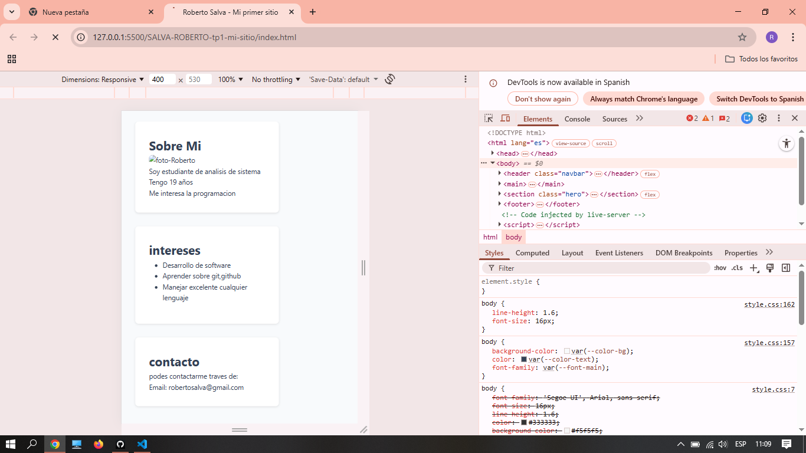

# Trabajo Práctico Final - Prácticas Profesionales 2

## Descripción
Este proyecto es un portafolio profesional diseñado para demostrar habilidades en maquetación moderna. 
Se aplicaron conceptos de **Mobile-First**, **CSS Grid** y **Flexbox**.

## Tecnologías Utilizadas
* **HTML5:** Estructura semántica.
* **CSS3:** Uso de variables (`:root`), Grid Areas y Flexbox.
* **Google Fonts:** Tipografía "Smooch Sans" (o la que elegiste).
* **Responsive Design:** 3 breakpoints para diferentes dispositivos.

## Demo en vivo
[Clic aquí para ver mi sitio] (https://github.com/Roberto-Damian-Salva/tp1-mi-sitio)

## Capturas de Pantalla
### celular

### tablet
![Tablet]

### computadora
